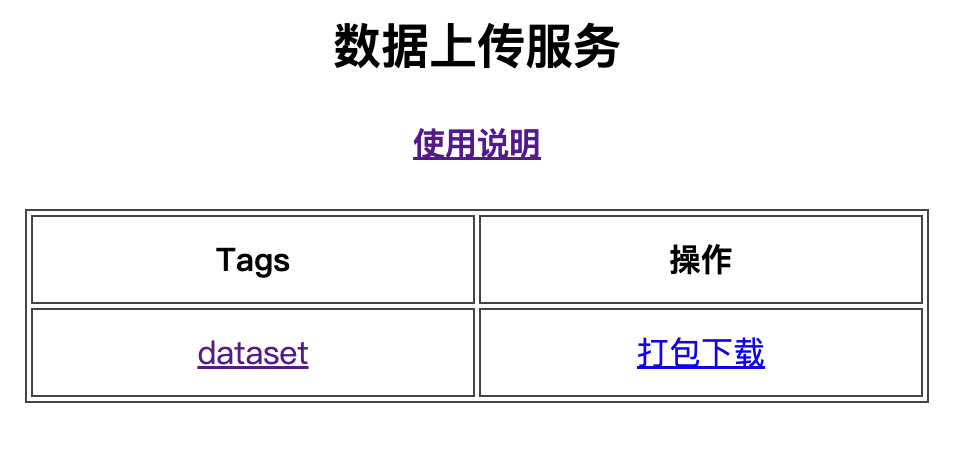
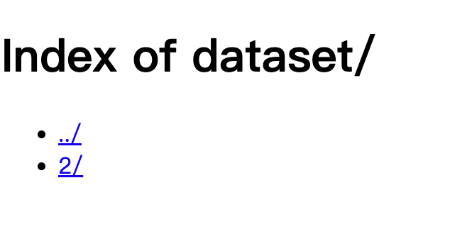

# 数据上传缓存服务
- 一个支持数据缓存到云服务的webserver
- 支持按tag上传数据、在线浏览数据、按tag打包下载数据
- 运行样例
 {width=30%}
 {width=30%}

### 背景

> 在做AI模型训练数据收集时（或其他类似数据收集时）需要把收集的数据方便的传给收集者。
> 提供一个数据换成服务，支持收集端把数据通过网络上传到云服务上，收集者在云服务上下载即可。


### 服务安装说明

> web服务可以放在云主机上（譬如腾讯、阿里云主机），也可以放在自己的电脑上，如果没公网ip，只能在局域网使用

- 安装python 和 django环境
```
pip install django
```

- 运行web服务
> 端口可自己指定，样例为8000
```
// 运行服务
python manage.py runserver 0.0.0.0:8000  

// 后台运行服务，可后台长期存在
nohup python manage.py runserver 0.0.0.0:8000 &
```

- 查看服务
> 打开网址 http://your_webserver_ip:8000/


### 如何接入服务
- 